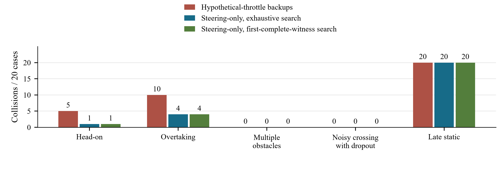

# CoCommand-USV

### Authority-Consistent Predictive Safety Filtering for Shared Vessel Control

[中文说明](README.zh-CN.md) · [All experimental results](docs/experimental_results.md) · [Methods and source mapping](docs/source_traceability.md) · [Build evidence](docs/test_evidence.md)

CoCommand-USV studies a practical problem in human–autonomy shared control: **a safety filter should not accept a human command because of a future maneuver it has no authority to execute.** The project implements a predictive, minimum-intervention filter for an unmanned surface vessel and evaluates how executable backup actions, search termination, and limited computation affect collision outcomes, operator intervention, and mission completion.

The online controller is a CPU-only C++ core, shared by Python experiments and a native runner. An independent Python plant supplies finer-step physical collision checks. The completed studies use synthetic vessel parameters and scripted operator commands.

## Main findings

| Research contribution | Measured result | Associated trade-off |
|---|---|---|
| Restrict predicted backups to executable steering actions | **0/90 versus 26/90 collisions** in paired synthetic encounters | Mean northward progress decreased from 4.698 to 2.257 m |
| Stop backup search after the first complete witness | **53.8% fewer integration steps; 57.5% mean per-case filter-call latency reduction** | Immediate decisions matched across **18,000 states**; P95 latency did not improve |
| Match candidate resolution to a fixed computation budget | At **2,048 steps**, a **4° versus 2°** grid achieved **47/60 versus 9/60 goals** in fresh-seed confirmation | Mean steering correction increased by **8.186°** over matched exposure |

The first comparator preserves the operator's throttle when executing commands but permits throttle changes inside predicted backups. It is a deliberate authority-mismatch comparator, not a claim of superiority over an independently validated navigation controller. The grid experiment compares fixed configurations; it does not evaluate online adaptive resolution.


## How the shared-control filter works

At each 100 ms control cycle, the filter checks the **exact, unquantized operator command first**. It predicts that current command followed by candidate future backup maneuvers. A candidate is accepted only if at least one complete backup trajectory has positive planning clearance at every required sample. If the operator's command fails, steering alternatives are checked in increasing modification order within the configured finite set.

In the reported steering-only controller, throttle remains under the operator's authority in both prediction and execution. The 10.1 s horizon contains 52 sample times; the independent plant checks physical hull separation every 20 ms, or 10 ms in refinement/confirmation. Physical separation and inflated planning clearance are recorded separately.

| Search outcome | Meaning | Next applied command in the reported steering-only mode |
|---|---|---|
| Complete witness found | A full predicted continuation passes the sampled clearance test | Apply the accepted current command for one control interval; replan on the next observation |
| Exhaustive no-witness | The declared finite candidate/backup library has been exhausted | Apply the current command associated with the highest survival-score fallback; retain operator throttle |
| Unknown | Computation ended before acceptance or exhaustive rejection was established | Retain operator throttle and command the currently measured steering angle; replan next cycle |

The fallback ranks predicted survival time with a small additional minimum-clearance term. It is a best-effort action, not an accepted witness. Unknown does not mean no safe action exists; neither outcome implies an automatic stop. Old witnesses and partial trajectories are not treated as new complete evidence. The [results and definitions](docs/experimental_results.md) explain the operators, budgets, endpoints, and uncertainty measures.

## Completed experiments

Each row identifies an actual study or validation, not merely a configurable feature. Repeated states, reused cases, and physics reruns are kept separate from fresh initial conditions.

| Experiment and purpose | Scope | Result |
|---|---|---|
| **Backup authority:** test whether predicted recovery is executable | 90 paired cases; 180 rollouts | Collisions 26/90 → 0/90; matched command pass-through 74.67% → 87.19%; reduced forward progress |
| **Exact branch deduplication:** remove redundant computation without changing results | 630 recorded states | Integration steps −1.70%; no command/outcome/clearance mismatches; latency change inconclusive |
| **First-complete-witness search:** exploit existential candidate acceptance | 18,000 replay states; 1,800 timed states, five repetitions | Steps −53.8%; mean per-case latency −57.5%; zero immediate-decision mismatches; no P95 improvement |
| **Work and deadline limits:** measure complete-witness availability under bounded search | Seven step limits and five soft deadlines; 270,900 calls across variants | At 512 steps, witness availability 25.86% → 93.68%; zero partial-witness acceptances; soft deadline overruns remain |
| **Budget-limited closed loop:** test whether replay gains become collision reductions | 30 paired cases; 60 rollouts, 512 steps/cycle | Collisions 20/30 → 19/30; unknown fraction 60.93% → 41.94%; no clear collision benefit |
| **Unknown-return diagnosis:** distinguish missing computation from finite-library rejection | 3,341 recorded decisions; 947 unknown returns | Generous-budget replay found 48 witnesses and 899 exhaustive rejections; not a closed-loop rescue experiment |
| **Held-out stress:** test harder geometry, motion, noise/dropout, and model mismatch | 100 fresh cases × three variants; 300 rollouts | Collisions 35/100 → 25/100; both steering-only search variants matched; all 20 very-late static cases collided |
| **Operator feedback × authority:** separate operator behavior from filter behavior | 60 reused initial conditions × four combinations; 240 rollouts | With goal feedback, goals 29/60 → 52/60 and collisions 31/60 → 5/60; preset-input operators reached no goals |
| **Candidate-grid discovery:** explore resolution × search × computation | 60 fresh cases; nine preset-input and five goal-feedback configurations; 840 rollouts | At 512 steps, both grids reached 4/60 goals; at 2,048, 2° → 4° gave 9/60 → 47/60, motivating separate confirmation |
| **Fresh-seed grid confirmation:** test the selected 2,048-step setting without retuning | 60 new pairs; 120 rollouts, 10 ms physics | Goals 9/60 → 47/60; paired gain 63.33 percentage points; matched steering correction +8.186° |
| **Same-case physics refinement:** assess dependence on collision-checking step size | 180 authority reruns and 120 feedback-mission reruns, 20 → 10 ms | Authority labels unchanged; mission goal labels unchanged, but three steering-only collision/timeout labels changed |

Preparatory checks comprised a separate 12-rollout pilot with 42 replay snapshots and short software smoke tests. They are not pooled into these estimates. The broader configurable experiment matrix is available but has not been run in full.

### Search efficiency: less work, with an explicit tail-latency check


The optimization stops only **after completing** a passing branch. Unsafe candidates still require exhaustive rejection. Of 18,000 states, 17,084 retained full 52-sample witnesses and 916 remained exhaustive no-witness. Integration steps fell from 14,221,230 to 6,572,286. Mean per-case latency reduction was 57.5% (95% interval 53.7–61.3%); P95 was 0.9043 → 0.9260 ms. These are desktop filter-call measurements including C-ABI overhead, not scan-to-actuator or ARM64 timings. A different future backup may be selected even when the immediate command is identical.

### Fixed-budget confirmation: task completion versus intervention


The 4° grid improved goal completion by 63.33 percentage points (paired 95% interval 53.33–73.33) but increased matched-exposure steering correction from 5.043° to 13.229° (difference interval 6.805–9.514°). Twelve of its 13 remaining collisions were crossing encounters. This follows a negative primary 512-step comparison and a positive exploratory 2,048-step comparison; discovery and confirmation remain separate datasets.

### Failure boundaries and operator sensitivity



Steering-only backups reduced collisions in head-on and overtaking stress encounters but did not resolve very-late static encounters. The original 0/90 result therefore describes its sampled distribution, not general collision-free behavior.

The operator study compares a preset steering signal with an ego-state/waypoint feedback script. Both are passed through a state-feedback safety filter, so **both complete vessel systems are closed loop**. Only the nominal operator is open loop in the preset-input condition. Neither script is a human-participant study.

The [full experimental results](docs/experimental_results.md) include all budget sweeps, all 14 discovery configurations, mission outcomes, physics sensitivity, confidence intervals, and the remaining figures. [Frozen aggregates and per-case evidence](artifacts/research/) retain failed cases as well as successful ones.

## Implementation and evaluation scope

- **Dynamics and perception:** eight-state nonlinear 3-DOF vessel model, first-order thrust/steering actuators, range-scan reconstruction, tracking and track memory, oriented hull geometry, and independent physical scoring.
- **Prediction extensions:** four-state constant-velocity Kalman estimation, an auxiliary smoothed-acceleration forecast, and three motion hypotheses (constant velocity, constant acceleration, coordinated turn) from a shared estimate. The internally named multiple-model option is **not a full interacting multiple-model filter bank**.
- **Configurable extensions:** executable authority, candidate sampling, guarded adaptive horizon, covariance margins, prediction hypotheses, backup libraries, and deadline-aware search. The comparative results above use the original smoothed constant-velocity predictor and inflation; Kalman/covariance and adaptive-horizon performance ablations remain to be done.
- **Research infrastructure:** one C++17 core through a C ABI, independent Python simulation, configuration validation, paired seeds, serial/resumable runs, provenance fingerprints, statistics, and plots. Runtime simulation/control require no neural network or GPU.

This is a finite-horizon, sampled predictive filter, not a CBF-QP controller or a continuous-time safety proof. Vessel parameters are documented synthetic assumptions. Computation is timed but its delay is not injected into the synchronous plant. Native ARM64 build/replay interfaces exist; physical board, boat, and participant validation remain separate next steps. See [known limitations](docs/known_limitations.md) and [parameter provenance](docs/source_traceability.md).

## Build, test, and run a small example

Linux x86-64 or native ARM64: CMake 3.20+, Ninja, a C++17 compiler, and Python 3.10+. The Python simulation package uses the standard library; plotting additionally requires Matplotlib. Optional pybind11 bindings are not needed for these commands.

```sh
cmake -S . -B build -G Ninja -DCMAKE_BUILD_TYPE=Release \
  -DCOCOMMAND_BUILD_TESTS=ON -DCOCOMMAND_BUILD_PYBIND=OFF
cmake --build build --parallel 2
ctest --test-dir build --output-on-failure
export PYTHONPATH="$PWD/python"
export COCOMMAND_NATIVE_LIB="$PWD/build/libcocommand_c.so"
python3 -m unittest discover -s tests/python -v
python3 -m cocommand doctor

# Four 0.5-second headless smoke tasks, not a research study.
python3 -m cocommand experiment --id E00 --tier smoke --seeds 0:1 \
  --duration 0.5 --run-root runs/readme-smoke
```

The latest local verification (22 September 2026) rebuilt the native core in a fresh directory, passed CTest (one executable containing multiple native checks), and passed 29 Python tests on Windows. [Commands and evidence](docs/test_evidence.md) distinguish desktop verification from cross-build and physical-board execution. The Linux CI workflow is provided; no hosted CI result is asserted.

## Select or reproduce experiments

List, validate, and expand configurations without starting a study:

```sh
python3 -m cocommand list-experiments
python3 -m cocommand list-controllers
python3 -m cocommand validate-config configs/experiments/E02_authority.yaml
python3 -m cocommand experiment --id E02 --tier pilot --dry-run
python3 -m cocommand batch --ids E01:E11 --tier main --dry-run
python3 -m cocommand.budget_study --stage dry-run
```

The general experiment/batch commands require `--confirm-formal` for non-smoke execution. Focused-study modules have their own explicit stages and **start computation when invoked**; they do not use that confirmation switch. Seed ranges are left-closed/right-open.

| Reproduction guide | Evidence covered |
|---|---|
| [Authority and search](docs/focused_study_reproduction.md) | Paired authority study, deduplication, complete-witness replay, physics refinement |
| [Budget, stress, and mission](docs/depth_validation_reproduction.md) | Bounded replay/closed loop, new stress cases, operator study |
| [Grid discovery and confirmation](docs/budget_allocation_reproduction.md) | Recorded unknown diagnosis, candidate-grid sweep, held-out confirmation |

Public aggregates allow the reported numbers to be inspected without rerunning simulation. Raw scan/control archives and frozen native binaries are local and excluded from Git. Replay studies require the parent trajectories described in these guides; a fresh clone must generate those first or obtain an approved archive. Matching run directories resume; changed source/configuration/native fingerprints require a new directory. Do not overwrite archival evidence to force a resume. Timing results depend on the host.

## ARM64 and hardware boundary

On a supported Linux ARM64 board with the prerequisites installed:

```sh
sh deploy/orangepi/build_native.sh
sh deploy/orangepi/diagnose.sh
sh deploy/orangepi/run_replay.sh
```

[Deployment](docs/deployment.md) covers dependencies and service templates; [the simulation bridge](docs/bridge_protocol.md) covers PC–board exchange. Mock, replay, and loopback are available without actuators. The board model, sensor and propulsion protocols, watchdog, and independent stop path still need confirmation. Unknown physical hardware refuses arming by default.

## Provenance and release status

The vessel implementation is separated from the inherited two-dimensional prototype; the latter remains a local, quarantined snapshot. [Source traceability](docs/source_traceability.md) distinguishes the supplied formulation, engineering assumptions, and implemented extensions.

Copyright, redistribution permission, and the repository license need owner/supervisor confirmation before public release. No open-source license is currently granted. Raw runs, private logs, local report-authoring material, third-party manuscripts, and toolchains are excluded from the Git publication set. See the [release review](docs/release_review.md) and [licensing checklist](docs/licensing.md).
