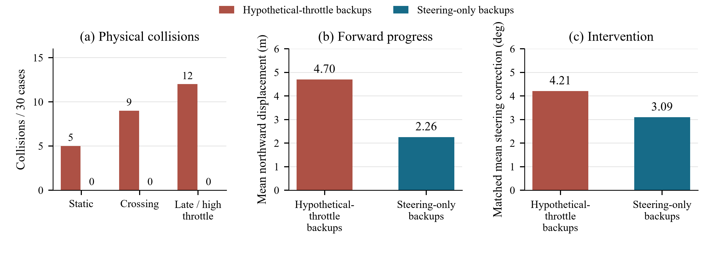
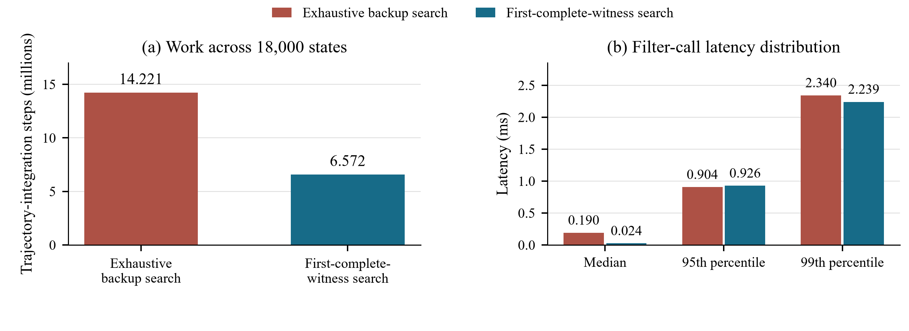
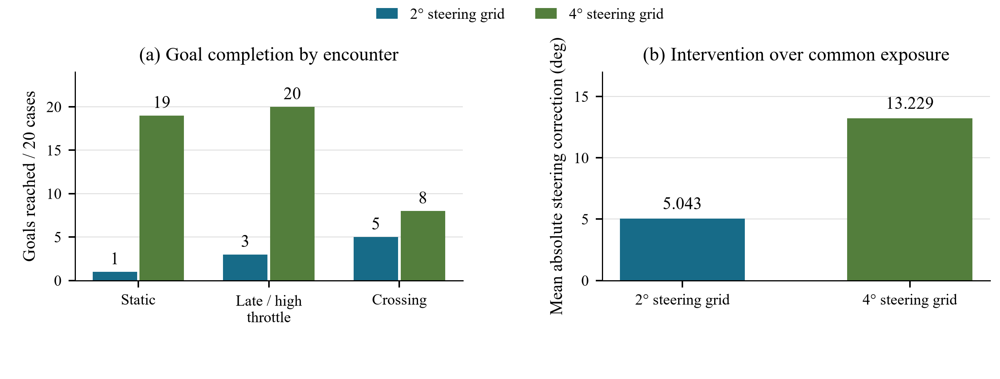

# CoCommand-USV

### 面向无人船共享控制的权限一致性预测安全过滤

[English](README.md) · [完整实验结果与图表](docs/experimental_results.md) · [公式与代码映射](docs/source_traceability.md) · [构建测试记录](docs/test_evidence.md)

本项目研究共享控制中的一个具体问题：**如果系统只能改舵，能否因为预测中的未来“减油门或反推”能够避障，就放行当前指令？** 预测依赖的恢复动作必须与实际控制权限一致。围绕这一问题，项目实现预测安全过滤器，并检验可执行备份、完整见证搜索和有限计算预算对碰撞、操作者干预与任务完成的影响。

控制热路径采用同一套 CPU C++ 核心，Python 负责独立被控对象、细步长碰撞检查、实验编排和统计。以下结果来自合成船模和脚本化操作者，不是实船或真人实验。

## 三项主要结果

| 研究内容 | 实际结果 | 同时观察到的代价 |
|---|---|---|
| 将未来备份限制为实际可执行的转向动作 | 90 组配对合成条件中，碰撞从 **26/90 降至 0/90** | 平均向北进度从 4.698 m 降至 2.257 m |
| 找到首条完整见证后提前结束备份搜索 | **积分步数减少 53.8%，逐案例平均调用延迟降幅 57.5%**；18,000 个状态的即时决策一致 | P95 延迟没有改善；选中的未来备份可能不同 |
| 固定预算下选择候选分辨率 | 在 **2,048 积分步**预算下，**4° 对比 2°** 网格的目标完成数为 **47/60 对比 9/60** | 匹配暴露时长下，平均转向修正增大 **8.186°** |

第一项的对照组在执行时也保留人的油门，但在预测备份中允许改变油门，用于隔离“预测权限与执行权限不一致”的影响。它不是与成熟可部署导航算法的全面排名。第三项比较固定网格配置，不等于已经验证了在线自适应采样算法。



## 控制逻辑与关键概念

每 100 ms 首先检查人的精确原始指令，不把它量化到转向网格。预测结构为“当前指令加未来备份”，只有完整预测轨迹的所有要求采样点都具有正规划间距，才作为可接受见证。若原指令不通过，再按改动由小到大的顺序检查有限候选。论文参照时域为 10.1 s，共 52 个采样时刻；独立物理仿真通常以 20 ms 检查真实船体间距，细化和新种子确认使用 10 ms。真实间距与含膨胀裕度的规划间距分别记录。

| 返回状态 | 含义 | 已报告的仅转向权限控制器下一步做什么 |
|---|---|---|
| 找到完整见证 | 至少一条完整备份通过采样间距检查 | 执行当前获准指令一个控制周期，下一周期重新规划 |
| 无见证（穷尽） | 规定的有限候选与备份集合已搜完，没有通过者 | 执行预测生存评分最高的回退当前指令，保留人的油门 |
| 未知（预算耗尽） | 搜索未完成，既不能确认接受，也不能宣告穷尽 | 保留人的油门，将当前实测舵角作为转向指令，下一周期重新规划 |

回退评分以预测生存时间为主，加上小权重的最小间距项；它不被标记为安全见证。未知和无见证都不代表自动停车。半条轨迹不能充当完整见证，旧见证不能直接作为新时刻的通过依据。

## 已完成的全部实验

同一案例的多配置重复、同一轨迹的状态回放和细物理步长复核，不计作新增独立案例。

| 实验目的 | 规模 | 主要结果 |
|---|---|---|
| **备份权限一致性**：验证恢复动作是否可执行 | 90 组配对条件，180 次仿真 | 碰撞 26/90 → 0/90；匹配时长下原指令通过率 74.67% → 87.19%；向北进度下降 |
| **精确分支去重**：减少重复积分 | 630 个回放状态 | 积分步数减少 1.70%，决策与间距一致；延迟改进的置信区间跨零 |
| **首条完整见证提前结束**：减少不必要的备份搜索 | 18,000 个状态；1,800 个计时状态，每个重复五次 | 积分步数 −53.8%，逐案例平均延迟降幅 57.5%；即时指令/状态无差异，P95 未改善 |
| **计算步数与软截止时间**：检验预算内完整见证可获得性 | 七档步数、五档截止时间，共 270,900 次调用 | 512 步下见证比例 25.86% → 93.68%；无半轨迹误接受，仍存在软时限超时 |
| **有限预算闭环**：回放改进是否转化为碰撞改进 | 30 组配对条件，60 次仿真 | 512 步下碰撞 20/30 → 19/30；未知比例 60.93% → 41.94%；碰撞收益尚不明确 |
| **未知状态诊断**：区分计算不够与有限集合不可行 | 3,341 个决策，包含 947 个未知 | 较大预算回放找到 48 个完整见证，另 899 个穷尽拒绝；不等于闭环救回了这些轨迹 |
| **新困难场景压力测试**：检验几何、运动、噪声/漏检和失配 | 100 个新案例、三种控制器，共 300 次仿真 | 碰撞 35/100 → 25/100；两种仅转向搜索决策一致；20 个极晚静态遭遇全部碰撞 |
| **操作者反馈 × 权限**：分离操作者与过滤器的作用 | 60 个既有初始条件、四种组合，共 240 次仿真 | 目标反馈下，完成 29/60 → 52/60，碰撞 31/60 → 5/60；预设输入组均未到达目标 |
| **候选分辨率探索**：比较网格、搜索与预算 | 60 个新案例、九种预设输入和五种目标反馈配置，共 840 次仿真 | 512 步下两种网格均完成 4/60；2,048 步下 2° → 4° 完成 9/60 → 47/60 |
| **新种子独立确认**：固定选中的预算后验证，不再调参 | 60 个新配对案例，120 次仿真，10 ms 物理步长 | 完成 9/60 → 47/60；增益 63.33 个百分点；平均转向修正 +8.186° |
| **同案例物理步长细化**：检查数值敏感性 | 权限实验 180 次、反馈任务 120 次重跑，20 → 10 ms | 权限实验结局不变；反馈任务到达标签不变，但仅转向组有三个碰撞/超时标签改变 |

另有独立准备性试运行（12 次仿真、42 个回放状态）及短时软件冒烟，不并入上面的统计样本。更大的正式实验矩阵已有配置，但没有全部执行。



首条完整见证优化把积分步数从 14,221,230 降至 6,572,286。逐案例平均调用延迟降幅的 95% 区间为 53.7%–61.3%，但 P95 为 0.9043 → 0.9260 ms。计时来自桌面 CPU，包含 Python/C ABI 调用开销，不是端到端或板端实时性能。



新种子确认中，完成率差的配对 95% 区间为 53.33–73.33 个百分点。匹配暴露时长下，转向修正从 5.043° 增至 13.229°，差值区间为 6.805°–9.514°。4° 网格剩余 13 次碰撞中，12 次来自交叉遭遇。512 步主要比较的负结果与 2,048 步探索结果均保留，不与独立确认混为一组。

“开环操作者”仅指名义人的输入是预设时间信号；其后仍接入状态反馈安全过滤器，因此完整无人船系统仍为闭环。“目标反馈操作者”使用本船姿态、角速度与目标位置生成指令，不读取障碍真值。两者均为脚本，而非真人操纵试验。

所有预算曲线、压力场景分项、四组任务结局、14 种探索配置、置信区间及物理敏感性见[完整实验结果](docs/experimental_results.md)。[统计与逐案例记录](artifacts/research/)保留失败样本，不只展示有利结果。

## 卡尔曼预测和其他已实现功能

障碍预测实现了四状态常速度卡尔曼估计、额外平滑的加速度预测，以及从同一个估计生成的常速度/常加速度/协调转弯三种假设。内部多模型选项**不是完整 IMM 滤波器组**，加速度选项也不是六状态常加速度卡尔曼滤波器。已有时间对齐、记忆过期、协方差等功能测试；上面的性能实验使用原平滑常速度预测和膨胀方式，尚不能归因于卡尔曼改进。

权限、采样、带保护自适应时域、协方差裕度、预测器、备份动作库、截止时间搜索均可配置。功能存在不等于各自已经获得性能提升证据。共享控制核心为有限时域采样预测过滤器，不是 CBF-QP 或连续时间安全证明。计算耗时有记录，但未作为延迟注入被控对象。

## 构建、测试和小规模运行

Linux x86-64 或原生 ARM64 需要 CMake 3.20+、Ninja、支持 C++17 的编译器及 Python 3.10+。仿真运行不需要第三方 Python 库，绘图另外需要 Matplotlib。

```sh
cmake -S . -B build -G Ninja -DCMAKE_BUILD_TYPE=Release \
  -DCOCOMMAND_BUILD_TESTS=ON -DCOCOMMAND_BUILD_PYBIND=OFF
cmake --build build --parallel 2
ctest --test-dir build --output-on-failure
export PYTHONPATH="$PWD/python"
export COCOMMAND_NATIVE_LIB="$PWD/build/libcocommand_c.so"
python3 -m unittest discover -s tests/python -v
python3 -m cocommand doctor
python3 -m cocommand experiment --id E00 --tier smoke --seeds 0:1 \
  --duration 0.5 --run-root runs/readme-smoke
```

2026 年 9 月 22 日在当前目录重新构建通过；CTest 原生测试通过，29 项 Python 测试通过。具体命令、平台及记录见[测试证据](docs/test_evidence.md)。

只列出、检查或展开实验，不执行仿真：

```sh
python3 -m cocommand list-experiments
python3 -m cocommand list-controllers
python3 -m cocommand validate-config configs/experiments/E02_authority.yaml
python3 -m cocommand experiment --id E02 --tier pilot --dry-run
python3 -m cocommand batch --ids E01:E11 --tier main --dry-run
python3 -m cocommand.budget_study --stage dry-run
```

一般实验入口的非冒烟执行需要 `--confirm-formal`；专题研究模块有自己的执行阶段，调用执行阶段就会运行，不使用这个保护开关。种子范围左闭右开。复现依次参考[权限和搜索](docs/focused_study_reproduction.md)、[预算/压力/任务](docs/depth_validation_reproduction.md)、[网格探索和确认](docs/budget_allocation_reproduction.md)。

Git 中包含汇总证据，不包含本地原始雷达/控制日志和冻结二进制。回放需要先生成或取得经批准的父实验数据，并按指南保持输入依赖；相同指纹才能断点续跑，变更源码、配置或原生库需使用新目录，不能覆盖历史记录来强行续跑。

## 橙派与公开发布

ARM64 原生构建、诊断、回放命令：

```sh
sh deploy/orangepi/build_native.sh
sh deploy/orangepi/diagnose.sh
sh deploy/orangepi/run_replay.sh
```

参见[部署说明](docs/deployment.md)和[电脑—板端仿真桥](docs/bridge_protocol.md)。构建、桌面模拟、实板回放和实船验证分别记录；目前尚无实板和实船性能数据。未知真实硬件默认拒绝使能，不猜测引脚、串口、推进器协议或停止动作。

原二维原型与船舶代码明确分开。公开前需要确认代码权属、继承材料再分发权限、项目许可证及研究结果披露许可。本地原始数据、工具链、构建缓存、私人日志和报告编辑目录不进入发布集合。详见[发布检查](docs/release_review.md)、[许可事项](docs/licensing.md)和[已知限制](docs/known_limitations.md)。
