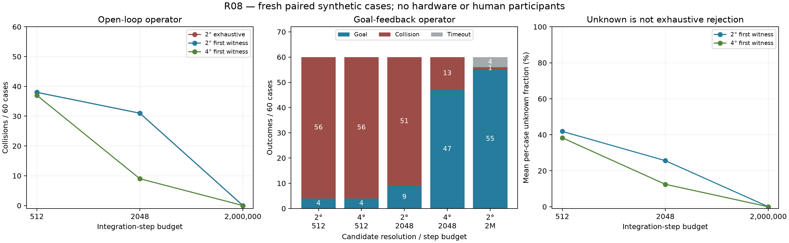

# R08: computation budget and candidate-resolution tradeoffs

840 new closed-loop executions on 60 fresh paired synthetic initial conditions: 540 open-loop and 300 goal-feedback. The same 60 cases are repeated across configurations; this is not 840 independent scenarios. No C++ algorithm was changed; existing sampling/early-termination/work-budget configurations were ablated. Controller authority, the full 10.1 s prediction horizon and all 52 witness samples were retained.



## Recorded-failure diagnosis

Reproduced 3341 decisions from all 30 original R05 limited-short trajectories with 0 command/outcome mismatches. Among 947 original unknowns, a generous-budget reference found 48 full witnesses, exhaustively rejected 899, and remained unknown for 0. Of 19 collided trajectories, 13 had at least one earlier unknown with a reference witness.

This single-decision counterfactual does not show that taking the alternative command would prevent collision. Exhaustive rejection refers only to the finite candidate/backup set under the prediction model, not physical impossibility. The replay uses observed scans and recorded ego state, never simulator obstacle truth.

## Open-loop operator, up to 20 s

| Policy / step budget | Collisions / 60 | Goals / 60 | Timeouts | Mean unknown % | Mean steps/cycle | Mean north progress, m |
|---|---:|---:|---:|---:|---:|---:|
| u2_exhaustive_b512 | 38 | not scored | not scored | 58.99 | 417.8 | 9.021 |
| u2_exhaustive_b2048 | 31 | not scored | not scored | 25.63 | 948.3 | 8.544 |
| u2_exhaustive_b2000000 | 0 | not scored | not scored | 0.00 | 776.8 | 2.582 |
| u2_first_b512 | 38 | not scored | not scored | 41.88 | 267.5 | 8.385 |
| u2_first_b2048 | 31 | not scored | not scored | 25.62 | 747.3 | 8.380 |
| u2_first_b2000000 | 0 | not scored | not scored | 0.00 | 351.1 | 2.582 |
| u4_first_b512 | 37 | not scored | not scored | 38.31 | 254.5 | 8.606 |
| u4_first_b2048 | 9 | not scored | not scored | 12.47 | 474.0 | 7.362 |
| u4_first_b2000000 | 0 | not scored | not scored | 0.00 | 230.3 | 2.556 |

## Goal-feedback operator, up to 40 s

| Policy / step budget | Collisions / 60 | Goals / 60 | Timeouts | Mean unknown % | Mean steps/cycle | Mean north progress, m |
|---|---:|---:|---:|---:|---:|---:|
| u2_first_b512 | 56 | 4 | 0 | 49.95 | 303.1 | 8.155 |
| u4_first_b512 | 56 | 4 | 0 | 45.99 | 290.0 | 8.155 |
| u2_first_b2048 | 51 | 9 | 0 | 31.86 | 908.2 | 8.837 |
| u4_first_b2048 | 13 | 47 | 0 | 12.15 | 516.9 | 13.909 |
| u2_first_b2000000 | 1 | 55 | 4 | 0.00 | 1001.2 | 15.152 |

## Same-budget paired resolution contrasts

Positive changes mean 4-degree minus 2-degree. Primary budget was fixed at 512 steps. Intervals resample paired cases within each of the three families (4,000 replicates), not cycles. Correction/pass-through/work/unknown metrics use matched exposure until the earlier endpoint of each pair. Secondary comparisons are exploratory; no multiple-testing-adjusted superiority claim is made.

| Contrast | Outcome | Paired change [95% interval] |
|---|---|---:|
| R08_open:budget512 | collision | -1.667 [-5.000, 0.000] pp |
| R08_open:budget512 | matched_mean_correction_deg | 0.332 [0.113, 0.526] degrees |
| R08_open:budget512 | matched_unknown_fraction | -3.303 [-3.708, -2.936] pp |
| R08_open:budget2048 | collision | -36.667 [-45.000, -28.333] pp |
| R08_open:budget2048 | matched_mean_correction_deg | 2.998 [2.022, 4.008] degrees |
| R08_open:budget2048 | matched_unknown_fraction | -8.737 [-10.096, -7.304] pp |
| R08_feedback:budget512 | collision | 0.000 [0.000, 0.000] pp |
| R08_feedback:budget512 | goal_reached | 0.000 [0.000, 0.000] pp |
| R08_feedback:budget512 | matched_mean_correction_deg | 0.084 [-0.123, 0.291] degrees |
| R08_feedback:budget512 | matched_unknown_fraction | -4.070 [-4.436, -3.751] pp |
| R08_feedback:budget2048 | collision | -63.333 [-73.333, -53.333] pp |
| R08_feedback:budget2048 | goal_reached | 63.333 [53.333, 73.333] pp |
| R08_feedback:budget2048 | matched_mean_correction_deg | 6.950 [5.678, 8.136] degrees |
| R08_feedback:budget2048 | matched_unknown_fraction | -12.857 [-13.916, -11.819] pp |

## Interpretation boundaries

- More budget is not an equal-cost optimization; the 2,000,000-step reference is finite, not mathematical infinity.
- A coarser grid changes admissible candidates and finite-set minimality. Even if it improves a budget-limited outcome, it cannot be called universally less intrusive or safer.
- Exact operator input remains first and unquantized. Ego-only waypoint feedback is a script, not a human participant.
- Unknown and no-witness fallback remain uncertified; a complete sampled witness is conditional on the prediction model.
- New seeds test fresh draws from the original three scenario distributions, not arbitrary new environments.
- Physics/scoring uses 20 ms and control 100 ms. This R08 study has not been numerically refined; earlier R07 showed that collision/timeout labels can change at 10 ms. Measured compute delay is not injected into dynamics.
- Truth-isolation audit checks manifest declarations, with existing API/unit tests; it is not a formal information-flow proof.

## Record audit

```json
{
  "trials": 840,
  "cycles": 116633,
  "accepted_cycles": 81706,
  "incomplete_or_nonpositive_witnesses": 0,
  "throttle_violations": 0,
  "exact_input_violations": 0,
  "step_budget_violations": 0,
  "time_alignment_violations": 0,
  "task_hash_violations": 0,
  "truth_access_manifest_violations": 0,
  "unexpected_outcomes": 0,
  "execution_failure_records": 0,
  "generous_budget_short_circuit_compared_cycles": 12000,
  "generous_budget_short_circuit_decision_mismatches": 0
}
```

Per-case/family statistics and collision records include all outcomes. See `docs/budget_allocation_protocol.md` and `docs/budget_allocation_reproduction.md`. Source/native snapshots and raw data remain in `runs/budget_allocation_v1/`. No hardware was used and nothing was pushed to GitHub.
