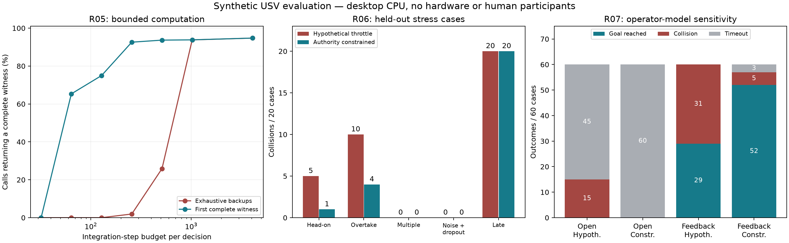

# R05–R07: deeper validation and failure boundaries

600 new closed-loop rollouts: 60 bounded-computation, 300 held-out stress, and 240 operator-model/mission sensitivity runs. The 90 original trajectories used for replay and the 60 reused mission initial conditions are NOT additional independent draws. Parameters were frozen before outcomes; failures are retained. Synthetic vessel; desktop CPU; no hardware or participant data.



## R05: complete-witness availability

Fractions below use all evaluated calls, not only favorable reference states. Repeated wall-clock calls share states and are not independent samples. Primary budgets were fixed at 512 integration steps and 0.25 ms. Wall-clock deadlines are soft, host/load dependent, and not injected into plant dynamics.

| Budget | Calls/variant | Exhaustive witness % | Optimized witness % | Paired gain, pp [case-bootstrap 95%] |
|---|---:|---:|---:|---:|
| steps:32 | 18000 | 0.00 | 0.00 | 0.00 [0.00, 0.00] |
| steps:64 | 18000 | 0.00 | 65.33 | 65.33 [62.92, 67.65] |
| steps:128 | 18000 | 0.00 | 74.98 | 74.98 [72.07, 77.83] |
| steps:256 | 18000 | 1.94 | 92.59 | 90.66 [89.46, 91.80] |
| steps:512 | 18000 | 25.86 | 93.68 | 67.82 [64.97, 70.57] |
| steps:1024 | 18000 | 93.81 | 93.82 | 0.02 [0.00, 0.04] |
| steps:4096 | 18000 | 94.74 | 94.77 | 0.02 [0.01, 0.04] |
| deadline_ms:0.1 | 1890 | 1.27 | 93.81 | 92.54 [90.37, 94.60] |
| deadline_ms:0.25 | 1890 | 76.30 | 95.50 | 19.21 [15.34, 23.33] |
| deadline_ms:0.5 | 1890 | 95.34 | 95.71 | 0.37 [0.05, 0.79] |
| deadline_ms:1.0 | 1890 | 95.71 | 95.77 | 0.05 [0.00, 0.16] |
| deadline_ms:2.0 | 1890 | 96.19 | 96.19 | 0.00 [0.00, 0.00] |

Replay `invalid_accepts` across all budgets/variants: 0.

Replay `accepted_reference_disagreements` across all budgets/variants: 0.

Replay `step_overshoots` across all budgets/variants: 0.

The optimized search may choose a different future backup than the exhaustive maximum-clearance witness. Equivalence applies to the immediate command/outcome when a complete witness is found; it is not equality of backup clearance or a recursive-safety proof.

### Closed loop, 512 steps

| Search | Collisions / 30 | Mean unknown fraction | Mean north progress, m |
|---|---:|---:|---:|
| limited_exhaustive | 20/30 | 0.609 | 8.767 |
| limited_short | 19/30 | 0.419 | 7.290 |

## R06: new stress cases

| Family | Hypothetical collisions | Constrained collisions | Optimized constrained collisions |
|---|---:|---:|---:|
| head_on | 5/20 | 1/20 | 1/20 |
| late_static | 20/20 | 20/20 | 20/20 |
| multi_obstacle | 0/20 | 0/20 | 0/20 |
| noisy_dropout_crossing | 0/20 | 0/20 | 0/20 |
| overtaking | 10/20 | 4/20 | 4/20 |

These deliberately difficult families mix geometry, speed, noise/dropout and model mismatch. This is not a factorial noise ablation, and failures cannot be causally attributed to any one component from this table alone. A finite-horizon witness is conditional on the prediction model; no-witness fallback is not a certified safe controller.

## R07: operator model × controller

Each row has the same 60 selected initial conditions; goal (8,0), radius 1.5 m, 40 s limit. Feedback uses ego pose/yaw rate and waypoint only, not obstacle truth. It is not a human-subject experiment. Do not interpret arrival rates as filter-only effects across different operator rows.

| Operator / filter | Goal | Collision | Timeout | Mean north progress, m | Mean arrival time among successes, s |
|---|---:|---:|---:|---:|---:|
| open_hypothetical | 0/60 | 15/60 | 45/60 | 4.400 | n/a |
| open_constrained | 0/60 | 0/60 | 60/60 | 2.380 | n/a |
| feedback_hypothetical | 29/60 | 31/60 | 0/60 | 11.350 | 16.34 |
| feedback_constrained | 52/60 | 5/60 | 3/60 | 14.556 | 16.60 |

Unequal stopping times make unpaired per-cycle command-preservation rates and successful-only travel times unsuitable as headline comparative claims. `trial_summary.csv` retains path length, goal-distance reduction, intervention and outcomes. `paired_statistics.json` includes case-level paired differences and bootstrap intervals.

## Audit and limits

```json
{
  "trials": 600,
  "control_cycles": 123593,
  "accepted_cycles": 88323,
  "invalid_accepted_witnesses": 0,
  "throttle_violations": 0,
  "truth_access_violations": 0,
  "task_hash_mismatches": 0,
  "alignment_mismatches": 0,
  "stress_optimization_compared_cycles": 19314,
  "stress_optimization_decision_mismatches": 0,
  "execution_failure_records": 0,
  "replay_calls": 270900,
  "replay_invalid_acceptances": 0,
  "soft_deadline_overruns_by_budget": {
    "0.1:short_circuit": {
      "calls": 1890,
      "returned_after_soft_budget": 117,
      "accepted_after_soft_budget": 0
    },
    "0.1:exhaustive": {
      "calls": 1890,
      "returned_after_soft_budget": 1866,
      "accepted_after_soft_budget": 0
    },
    "0.25:short_circuit": {
      "calls": 1890,
      "returned_after_soft_budget": 85,
      "accepted_after_soft_budget": 0
    },
    "0.25:exhaustive": {
      "calls": 1890,
      "returned_after_soft_budget": 451,
      "accepted_after_soft_budget": 3
    },
    "0.5:short_circuit": {
      "calls": 1890,
      "returned_after_soft_budget": 78,
      "accepted_after_soft_budget": 0
    },
    "0.5:exhaustive": {
      "calls": 1890,
      "returned_after_soft_budget": 85,
      "accepted_after_soft_budget": 0
    },
    "1.0:short_circuit": {
      "calls": 1890,
      "returned_after_soft_budget": 77,
      "accepted_after_soft_budget": 0
    },
    "1.0:exhaustive": {
      "calls": 1890,
      "returned_after_soft_budget": 78,
      "accepted_after_soft_budget": 0
    },
    "2.0:short_circuit": {
      "calls": 1890,
      "returned_after_soft_budget": 32,
      "accepted_after_soft_budget": 0
    },
    "2.0:exhaustive": {
      "calls": 1890,
      "returned_after_soft_budget": 33,
      "accepted_after_soft_budget": 0
    }
  }
}
```

All 52 discrete witness samples must pass positive clearance. This is not continuous-time verification. The independent plant checks real hull separation at 20 ms, but does not model waves, currents, real sensor faults, or actual actuator protocols. Compute latency is measured but not injected into the synchronous plant. Prior 10 ms refinement covered R01, not this entire new suite. Original R01 zero observed collisions remain true only for its original 90 cases; use new stress failures when discussing generalization.

Reproduce with the commands in `docs/depth_validation_reproduction.md`. Raw local scans/control logs and frozen source/native snapshots are under `runs/depth_validation_v1/`; private absolute-path test logs remain ignored by Git.


## Post-analysis R07 numerical sensitivity

Repeat all 120 feedback-operator rollouts at 10 ms physics/scoring instead of 20 ms; same cases, 100 ms control, fixed policy and controller. These are NOT new independent trials. This follow-up was specified after the primary outcomes, before its own execution, without retuning.

| Filter | Goals, 20→10 ms | Collisions, 20→10 ms | Changed goal / collision labels | Max absolute gap change, m |
|---|---:|---:|---:|---:|
| feedback_hypothetical | 29→29/60 | 31→31/60 | 0 / 0 | 0.0191 |
| feedback_constrained | 52→52/60 | 5→4/60 | 0 / 3 | 1.3142 |

Discrete tracking/search can change closed-loop trajectories after small plant differences. Even unchanged goal counts do not establish numerical convergence or continuous-time safety. Every paired label/gap discrepancy is retained in `physics_refinement.json`.

Refinement record audit: `{"trials": 120, "cycles": 18185, "invalid_accepted_witnesses": 0, "throttle_violations": 0, "execution_failures": 0}`.
