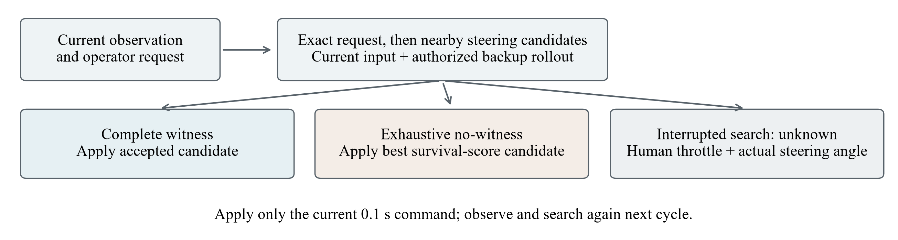
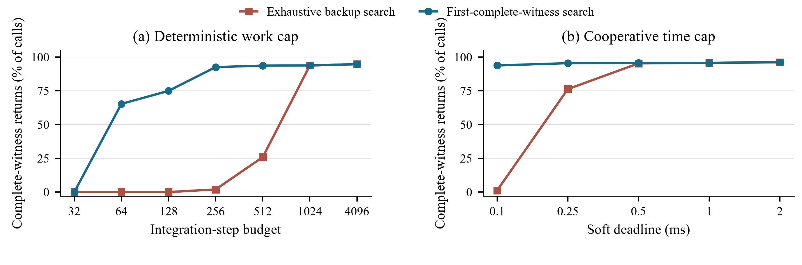
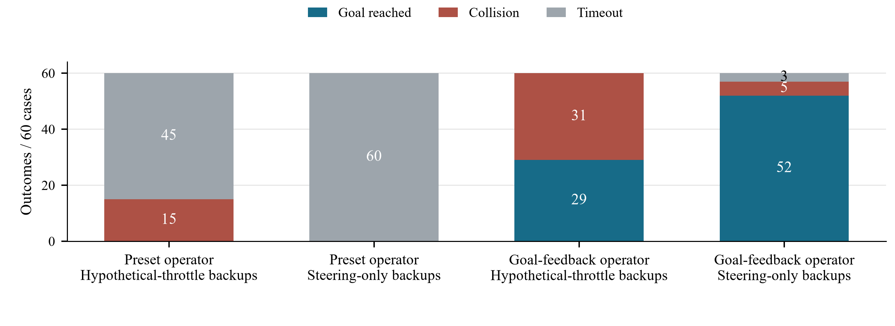
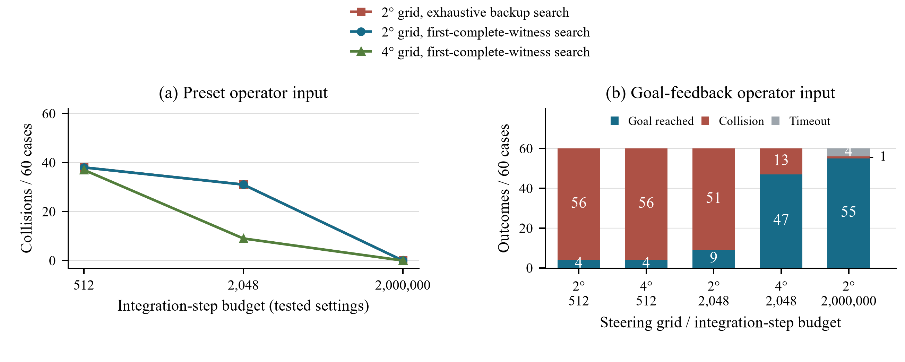

# Experimental results

[Project overview](../README.md) · [中文说明](../README.zh-CN.md)

This page collects the completed synthetic simulation and desktop-replay studies. It
separates the research question, comparison, observed result, and interpretation of each
experiment. Counts refer to cases, rollouts, or recorded states as explicitly indicated.

## Definitions and common setup

- **Case:** an initial condition, encounter geometry/motion, and random seed. A paired
  comparison runs both configurations on the same case. Configuration repeats and recorded
  control cycles are not independent new cases.
- **Rollout:** one closed-loop simulation of one configuration on one case. Collision,
  goal arrival where enabled, or the time limit ends the rollout; collision has priority
  over arrival at the same physics step.
- **Preset-input operator:** a time-dependent steering script, 0.7° sin(0.3t), with fixed
  throttle. Its input generation is open loop. The downstream safety filter uses current
  observations, so the complete vessel system remains closed loop.
- **Goal-feedback operator:** an ego-state/waypoint script. Steering is the clipped value
  of 1.6 times wrapped heading error minus 1.8 times yaw rate, within ±30°. It does not
  observe obstacle truth. Mission target: (8, 0) m; arrival radius: 1.5 m; limit: 40 s.
- **Hypothetical-throttle comparator:** execution preserves operator throttle, while
  future predicted backups may change throttle. **Steering-only backups** preserve that
  throttle in both prediction and execution. This contrast isolates authority consistency.
- **Complete witness:** one candidate-now/backup-later prediction with positive planning
  clearance at all 52 samples over 10.1 s. All required obstacle/motion hypotheses must pass.
  Only the current command is executed, followed by replanning. The test is sampled, not
  a continuous-time guarantee.
- **No-witness fallback:** after finite-library exhaustion, apply the candidate associated
  with the best survival score, using predicted survival time plus 0.001 times minimum
  clearance clipped to [−100, 100]. **Unknown fallback:** when search is incomplete, retain
  operator throttle and command the measured current steering angle. These are different
  outcomes and neither is automatically a stop or a certified safe continuation.
- **Physical versus planning gap:** the independent plant/scorer uses true hull geometry;
  the filter uses reconstructed obstacles and added safety margins. Obstacle truth is not
  an input to the controller. Own-vessel state is supplied exactly in these simulations.
- **Matched exposure:** compare a pair only until its earlier endpoint, then average at
  case level. After paths diverge this is equal elapsed exposure, not identical states.
- **Statistical intervals:** reported paired 95% bootstrap intervals resample cases, with
  family stratification where specified by the source protocol. They do not treat cycles
  or repeated timing calls as independent samples. “pp” means percentage points.
- **Computation:** a step budget counts trajectory-integration work, not milliseconds.
  Deadline limits are cooperative software checks. Timing is recorded but not injected as
  actuation delay into the synchronous plant.

The plant uses synthetic eight-state vessel/actuator parameters, a 100 ms control interval,
and normally 20 ms physics/scoring. The reported comparative studies retain the original
smoothed constant-velocity obstacle predictor and inflation mode.

## 1. Backup authority and operator-command preservation

**Question.** Does restricting backup predictions to executable actions change outcomes?
The only paired intervention is the backup authority model; both controllers preserve the
operator's applied throttle. Ninety cases span three families; each variant runs for at
most 20 s, giving 180 rollouts.

| Encounter family | Hypothetical-throttle collisions | Steering-only collisions |
|---|---:|---:|
| Static obstacle | 5/30 | 0/30 |
| Crossing obstacle | 9/30 | 0/30 |
| Late encounter at high throttle | 12/30 | 0/30 |
| Total | 26/90 | 0/90 |

The paired collision change is −28.9 pp, 95% interval [−38.9, −20.0]. The zero-event
steering-only result has a Wilson upper 95% bound of 4.09%. The comparator accepted
throttle-dependent witnesses in 5,219/12,330 accepted cycles (42.3%); the constrained
library selected none. Both had zero applied-throttle violations.

| Metric | Hypothetical throttle | Steering only |
|---|---:|---:|
| Mean minimum physical gap, m | 1.112 | 1.816 |
| Mean northward progress, m | 4.698 | 2.257 |
| Exact command pass-through, matched exposure | 74.67% | 87.19% |
| Mean absolute steering correction, matched exposure | 4.210° | 3.094° |

The supplemental intent analysis covers 14,607 matched cycles across 90 equally weighted
cases. Pass-through increased by 12.52 pp [9.14, 16.05]; correction changed by −1.116°
[−1.822, −0.425]. These improvements coexist with lower forward progress: the filter is
not itself a route planner.

Evidence: [statistics](../artifacts/research/2026-09-17/statistics.json),
[paired cases](../artifacts/research/2026-09-17/paired_case_summary.csv),
[protocol](resume_study_protocol.md).

## 2. Exact branch deduplication

**Question.** Can removing identical backup branches save useful computation without
changing the controller? On 630 recorded states, integration steps changed from 445,353
to 437,784 (−1.70%), and evaluated branches from 16,884 to 16,564. There were zero
command, outcome, or clearance mismatches. Mean per-case latency reduction was 1.06%,
95% interval [−0.50%, 2.52%]; a latency improvement was not established.

## 3. First-complete-witness search

**Question.** Once an acceptable candidate has one complete witness, must other backups
be searched? The optimized implementation stops at that point; rejection still requires
exhausting the declared library. Candidate order, exact operator priority, horizon, and
clearance checks are unchanged. This option is for steering-only minimum-modification
search, not emergency-authority commitment or maximum-clearance selection.

| Measure | Exhaustive backup search | First complete witness |
|---|---:|---:|
| Integration steps, 18,000 states | 14,221,230 | 6,572,286 |
| Median of per-state median latency, ms | 0.1896 | 0.0243 |
| P95 of per-state median latency, ms | 0.9043 | 0.9260 |
| P99 of per-state median latency, ms | 2.3401 | 2.2395 |

Immediate command/outcome mismatches: **0/18,000**, also matching the original trace.
There were 17,084 accepted complete witnesses, 916 exhaustive no-witness decisions, and
no unknown returns. Work decreased 53.8%. Timing used 1,800 states with five repetitions
per variant, alternating order after warm-up. Mean per-case relative latency reduction
was 57.5% [53.7%, 61.3%]. This statistic is not the ratio of two pooled mean latencies.

Timing host: Intel Core i7-12700H, Windows 11, Release build. The measured filter call
includes Python/C-ABI overhead. Immediate-decision agreement does not imply the same
selected backup or clearance; the first acceptable backup may have less margin.

Evidence for Sections 2–3: [primary/follow-up statistics](../artifacts/research/2026-09-17/statistics.json),
[audit](../artifacts/research/2026-09-17/evidence_audit.json).

## 4. Complete-witness availability under work and deadline limits

**Question.** How often can each search finish a complete witness under the same limit?
Seven work limits reuse 18,000 states per variant. Five soft deadlines use 630 states,
each repeated three times per variant. Total calls across both variants: 270,900.

| Integration-step budget | Exhaustive witness rate | First-complete-witness rate |
|---|---:|---:|
| 32 | 0.00% | 0.00% |
| 64 | 0.00% | 65.33% |
| 128 | 0.00% | 74.98% |
| 256 | 1.94% | 92.59% |
| 512 | 25.86% | 93.68% |
| 1,024 | 93.81% | 93.82% |
| 4,096 | 94.74% | 94.77% |

| Soft deadline, ms | Exhaustive witness rate | First-complete-witness rate |
|---|---:|---:|
| 0.10 | 1.27% | 93.81% |
| 0.25 | 76.30% | 95.50% |
| 0.50 | 95.34% | 95.71% |
| 1.00 | 95.71% | 95.77% |
| 2.00 | 96.19% | 96.19% |

At 512 steps, the paired gain was 67.82 pp [64.97, 70.57]. All conditions had zero
incomplete-witness acceptances and zero integration-step overshoots. Software deadlines
were not hard deadlines: at 0.25 ms, 451/1,890 exhaustive calls and 85/1,890 optimized
calls returned late; three exhaustive calls and zero optimized calls accepted after that
limit. Repeated timing calls are not independent encounter samples.

## 5. Budget-limited closed-loop outcomes

**Question.** Do replay gains translate to safer trajectories? Thirty paired cases were
run with a 512-step budget, giving 60 rollouts.

| Search | Collisions | Mean unknown fraction | Mean northward progress |
|---|---:|---:|---:|
| Exhaustive backups | 20/30 | 60.93% | 8.767 m |
| First complete witness | 19/30 | 41.94% | 7.290 m |

The paired collision difference was −3.33 pp [−10.00, 0.00]. Reduced unknown frequency
did not establish a clear closed-loop collision benefit. Live trajectories depart from
the recorded-state distribution used in replay.

## 6. Diagnosing unknown returns

**Question.** Was an unknown caused by missing computation or by lack of a witness in the
finite library? Replay reproduced all 3,341 recorded decisions from the 30 optimized,
budget-limited trajectories without command/outcome mismatch. Of 947 unknown returns,
a generous-budget reference found 48 complete witnesses and 899 exhaustive rejections;
none remained unknown. Thirteen of the 19 collided trajectories had an earlier unknown
with a reference witness. This is a single-decision diagnosis, not evidence that an
alternative closed-loop trajectory would have avoided those collisions.

Evidence: [diagnostic cases](../artifacts/research/2026-09-17-budget/diagnosis_cases.json),
[budget-study statistics](../artifacts/research/2026-09-17-budget/statistics.json).

## 7. Held-out stress encounters

**Question.** Where does the authority result generalize, and where does it fail? One
hundred new cases span five harder families; three variants give 300 rollouts. These
families jointly change geometry, motion, noise/dropout, and model mismatch, rather than
isolating each factor in a factorial experiment.

| Stress family | Hypothetical throttle | Steering-only exhaustive | Steering-only first witness |
|---|---:|---:|---:|
| Head-on | 5/20 | 1/20 | 1/20 |
| Overtaking | 10/20 | 4/20 | 4/20 |
| Multiple obstacles | 0/20 | 0/20 | 0/20 |
| Noisy crossing with missed detections | 0/20 | 0/20 | 0/20 |
| Very-late static encounter | 20/20 | 20/20 | 20/20 |
| Total collisions | 35/100 | 25/100 | 25/100 |

The authority contrast was −10 pp [−17, −3]. The two steering-only search variants
matched immediate decisions over 19,314 compared cycles. Very-late encounters remain
a failure boundary; no-witness does not prove a collision physically unavoidable.

## 8. Operator feedback and mission completion

**Question.** How does nominal operator behavior affect the interpretation of filter
performance? Sixty selected initial conditions are reused in a two-by-two comparison,
giving 240 rollouts. They are not 60 additional independent draws from the primary cohort.

| Operator | Backup authority | Goals / 60 | Collisions / 60 | Timeouts / 60 | Mean northward progress |
|---|---|---:|---:|---:|---:|
| Preset input | Hypothetical throttle | 0 | 15 | 45 | 4.400 m |
| Preset input | Steering only | 0 | 0 | 60 | 2.380 m |
| Goal feedback | Hypothetical throttle | 29 | 31 | 0 | 11.350 m |
| Goal feedback | Steering only | 52 | 5 | 3 | 14.556 m |

Within the goal-feedback rows, the paired goal gain is 38.33 pp [21.67, 55.00] and the
collision change is −43.33 pp [−58.33, −28.33]. Comparing different operator rows does
not isolate a filter-only effect. Successful-only arrival means (16.34 versus 16.60 s)
use different successful subsets and are not a paired travel-time improvement.

Evidence for Sections 4–5 and 7–8: [study statistics](../artifacts/research/2026-09-17-depth/statistics.json),
[paired intervals](../artifacts/research/2026-09-17-depth/paired_statistics.json),
[trial summaries](../artifacts/research/2026-09-17-depth/trial_summary.csv),
[protocol](depth_validation_protocol.md).

## 9. Candidate-resolution discovery

**Question.** At fixed computation, does a coarser grid leave more work for complete
verification? Sixty fresh cases are repeated across 14 configurations: nine preset-input
conditions (540 rollouts) and five goal-feedback conditions (300 rollouts). Exact operator
input is still checked first and is not rounded to either grid. Horizon and authority stay
fixed. The original primary comparison uses 512 steps; other budgets are exploratory.

### Preset-input operator, at most 20 s

Goals are not an endpoint for this subset.

| Steering grid | Backup search | Step budget | Collisions / 60 | Mean unknown fraction | Mean steps/cycle |
|---|---|---:|---:|---:|---:|
| 2° | Exhaustive | 512 | 38 | 58.99% | 417.8 |
| 2° | Exhaustive | 2,048 | 31 | 25.63% | 948.3 |
| 2° | Exhaustive | 2,000,000 | 0 | 0.00% | 776.8 |
| 2° | First complete | 512 | 38 | 41.88% | 267.5 |
| 2° | First complete | 2,048 | 31 | 25.62% | 747.3 |
| 2° | First complete | 2,000,000 | 0 | 0.00% | 351.1 |
| 4° | First complete | 512 | 37 | 38.31% | 254.5 |
| 4° | First complete | 2,048 | 9 | 12.47% | 474.0 |
| 4° | First complete | 2,000,000 | 0 | 0.00% | 230.3 |

### Goal-feedback operator, at most 40 s

| Steering grid | Step budget | Goals / 60 | Collisions / 60 | Timeouts / 60 | Mean unknown fraction | Mean steps/cycle |
|---|---:|---:|---:|---:|---:|---:|
| 2° | 512 | 4 | 56 | 0 | 49.95% | 303.1 |
| 4° | 512 | 4 | 56 | 0 | 45.99% | 290.0 |
| 2° | 2,048 | 9 | 51 | 0 | 31.86% | 908.2 |
| 4° | 2,048 | 47 | 13 | 0 | 12.15% | 516.9 |
| 2° | 2,000,000 | 55 | 1 | 4 | 0.00% | 1,001.2 |

All five goal-feedback conditions use first-complete-witness search. There was no 4°,
generous-budget goal-feedback condition. The primary 512-step comparison showed no
goal gain. At the selected 2,048-step setting, the gain accompanied +6.950° matched
steering correction [5.678, 8.136] in this discovery cohort. A larger work allowance is
not an equal-cost optimization; 2,000,000 steps is a finite reference, not infinity.

Audits covered 840 rollouts, 116,633 cycles, and 81,706 accepted cycles, with zero logged
partial/nonpositive-witness acceptances, throttle violations, exact-input violations,
step-budget violations, or time-alignment violations. Generous-budget search variants
matched over 12,000 replayed cycles.

Evidence: [statistics](../artifacts/research/2026-09-17-budget/statistics.json),
[trial summaries](../artifacts/research/2026-09-17-budget/trial_summary.csv),
[protocol](budget_allocation_protocol.md).

## 10. Fresh-seed confirmation at 2,048 steps

**Question.** Does the selected secondary setting reproduce on new draws without
retuning? A separate protocol fixed 2,048 steps, both grid resolutions, first-witness
search, steering-only authority, and goal feedback before the new outcomes. Sixty fresh
pairs give 120 rollouts, using 10 ms physics. These are new seeds from the original three
family distributions, not a new environment distribution or a same-case convergence test.

| Measure | 2° grid | 4° grid |
|---|---:|---:|
| Goals | 9/60 | 47/60 |
| Collisions | 51/60 | 13/60 |
| Timeouts | 0/60 | 0/60 |
| Mean unknown fraction, whole rollout | 31.72% | 11.89% |
| Mean unknown fraction, matched exposure | 31.79% | 18.93% |
| Mean steering correction, matched exposure | 5.043° | 13.229° |
| Mean northward progress | 8.995 m | 14.113 m |

Paired effects (4° minus 2°): goal gain **63.33 pp [53.33, 73.33]**; matched correction
**+8.186° [6.805, 9.514]**; matched unknown fraction **−12.861 pp [−14.017, −11.608]**.
Whole-rollout and matched-exposure unknown rates have different denominators and should
not be interchanged. Static-case goals were 1/20 → 19/20, late/high-throttle 3/20 → 20/20,
and crossing 5/20 → 8/20. Twelve of the 13 remaining coarse-grid collisions were crossings.

The 120-rollout, 14,482-cycle audit found zero recorded invalid witnesses, throttle
violations, budget violations, alignment violations, or exact-input violations.

Evidence: [confirmation statistics](../artifacts/research/2026-09-17-budget/confirmation_statistics.json),
[frozen confirmation protocol](budget_confirmation_protocol.md).

## 11. Same-case numerical sensitivity

**Question.** Are the observed outcomes sensitive to the independent physics/scoring
step? These runs halve that step from 20 to 10 ms while preserving the 100 ms control
interval, initial conditions, policy, and controller. They are repeated cases, not fresh
statistical evidence.

| Same-case rerun | Rollouts | Result |
|---|---:|---|
| Primary authority comparison | 180 | Collision counts remain 26/90 versus 0/90; all outcome labels unchanged; maximum minimum-gap change 0.2184 m |
| Goal-feedback mission, hypothetical throttle | 60 | Goals 29 → 29; collisions 31 → 31; no outcome-label changes |
| Goal-feedback mission, steering only | 60 | Goals 52 → 52; collisions 5 → 4; timeouts 3 → 4; three individual collision/timeout labels change |

The feedback-mission maximum minimum-gap change reached 1.3142 m. Discrete perception
and control decisions can diverge after small integration differences. These checks
measure sensitivity; they do not establish numerical convergence for all studies.

Evidence: [primary statistics](../artifacts/research/2026-09-17/statistics.json),
[mission refinement](../artifacts/research/2026-09-17-depth/physics_refinement.json).

## What is implemented but not yet comparatively evaluated

The obstacle-estimation extension uses a four-state constant-velocity Kalman estimate,
Joseph-form covariance update, timestamp-aware prediction, and missing-observation
memory/expiry. Acceleration prediction adds separately smoothed acceleration. The
three-motion option generates velocity, acceleration, and turn hypotheses from a shared
estimate; it is not a full interacting multiple-model filter bank. Covariance margins
propagate position uncertainty into the planning check.

Functional checks cover estimation timing, memory, covariance, and hypothesis generation.
The reported experiments do not isolate a Kalman, multi-model, covariance-margin, or
adaptive-horizon performance effect. Those ablations, the full planned experiment matrix,
physical ARM64 replay, boat trials, and participant evaluation remain separate work.

## Preparation, reproducibility, and evidence scope

A disjoint preparatory pilot contained 12 rollouts and 42 replay snapshots. Build tests
and short smoke runs are recorded separately in [test evidence](test_evidence.md).
Results here come from completed archived studies, not from that smoke validation.

The figures were copied without modification from the revised academic report. Numerical
sources are the frozen aggregate files linked above. Raw simulation records and historical
source/native snapshots are retained locally, excluded from Git; exact historical replay
requires those inputs. Fresh data collection uses the documented parent-study dependencies
and fingerprint-checked run directories. See the [reproduction guides](../README.md#select-or-reproduce-experiments).
